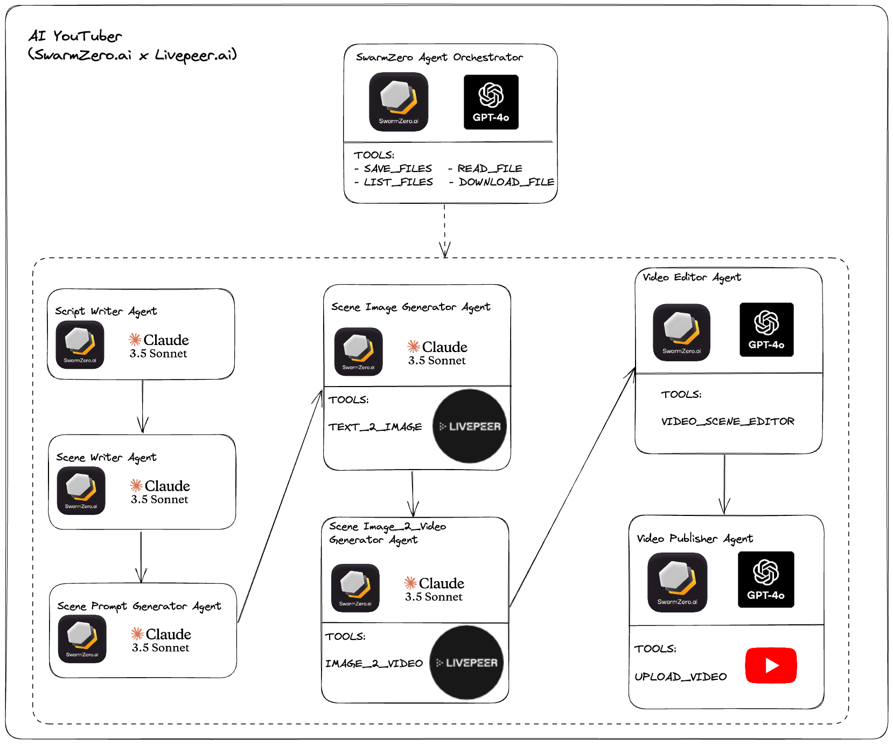

# Livepeer Youtube Video Generator Swarm

## Description

The Livepeer Youtube Video Generator Swarm is an AI-powered tool that automates the process of creating and uploading YouTube videos. It utilizes a swarm of specialized agents to handle different aspects of video production, from script writing to YouTube uploading.

## Agent Swarm Architecture Diagram


## Features

- Automated video creation pipeline
- AI-powered script and scene writing
- Image and video generation using Livepeer AI
- Automatic video editing and compilation
- YouTube upload integration

## Installation

1. Clone the repository:
   ```
   git clone https://github.com/hivenetwork-ai/example-agents
   cd livepeer-youtube-video-generator
   ```

2. Install the required dependencies:
   ```
   pip install -r requirements.txt
   ```

3. Set up environment variables:
   Create a `.env` file in the root directory and add necessary API keys and credentials.

4. Set up YouTube API credentials:
   Place your `client_secret.json` file in the root directory.
   You can get your OAuth 2.0 API key using Google API Console [here](https://developers.google.com/identity/protocols/oauth2).
   You should add `http://localhost:8088` as a valid redirect URI for your OAuth client ID.

## Usage

Run the main script:

Follow the prompts to enter your video topic. The swarm will then generate and upload a video based on your input.

## Configuration

The swarm behavior can be configured in the `hive_config.toml` file. You can adjust agent models, timeouts, and instructions here.

## Project Structure

- `main.py`: Entry point of the application
- `swarm/`: Contains the core swarm logic and agent definitions
- `swarm/tools/`: Utility functions for file handling, API interactions, and video processing
- `hive_config.toml`: Configuration file for the swarm and its agents

## Dependencies

This project relies on several key libraries and APIs:

- hive-agent: For swarm intelligence and agent coordination
- Livepeer AI: For image and video generation
- Google API Client: For YouTube upload functionality
- MoviePy: For video editing and processing

For a complete list of dependencies, refer to the `requirements.txt` file.

## Contributing

Contributions are welcome! Please feel free to submit a Pull Request.

## Acknowledgements

- Livepeer for providing the AI image and video generation capabilities
- SwarmZero.ai for the swarm intelligence framework
